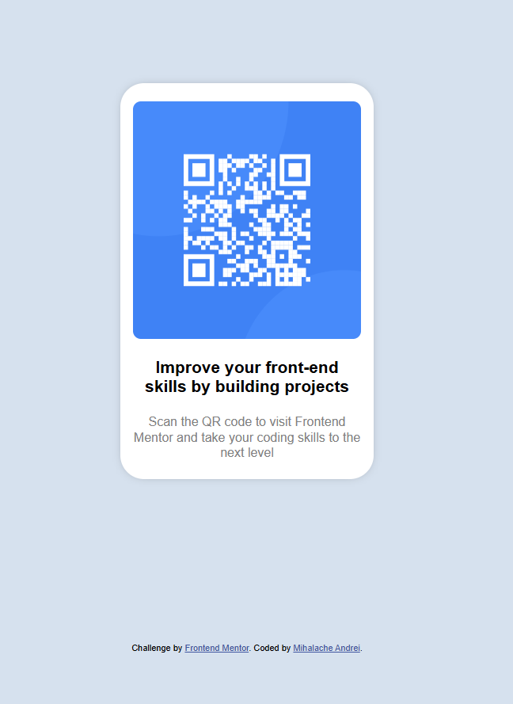

# Frontend Mentor - QR code component solution

This is a solution to the [QR code component challenge on Frontend Mentor](https://www.frontendmentor.io/challenges/qr-code-component-iux_sIO_H). Frontend Mentor challenges help you improve your coding skills by building realistic projects. 

**Note: I did this challenge before reading everything , I tried to be as close as possible visually speaking **

## Overview

### Screenshot

### Links

- Solution URL: [Solution URL](https://www.frontendmentor.io/solutions/qr-code-component-solution-9qqBAiHV0F)
- Live Site URL: [Live URL](http://andrei.loveslife.biz/qr)

### Built with

- Semantic HTML5 markup
- CSS custom properties
- Flexbox
- CSS Grid
